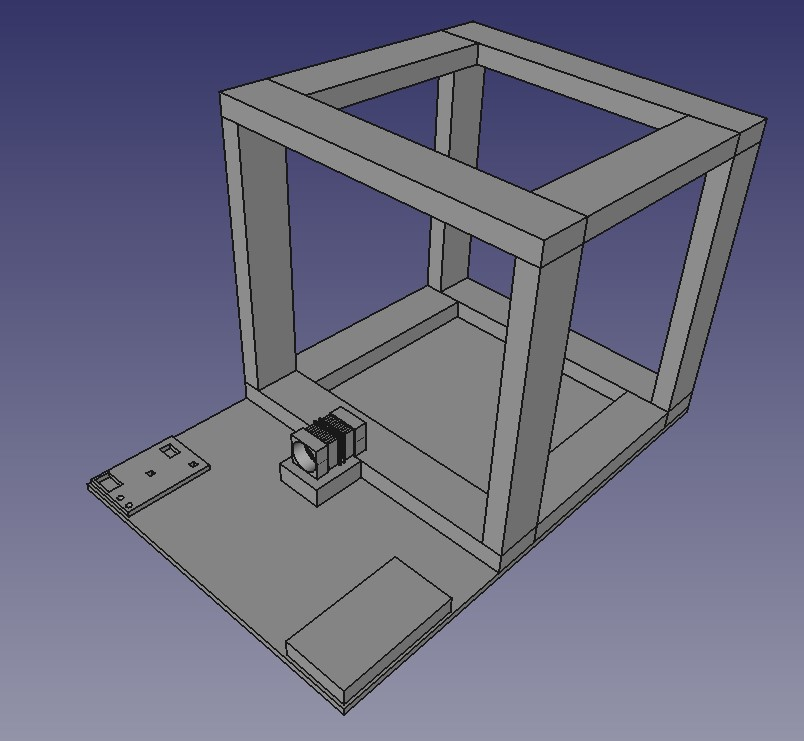
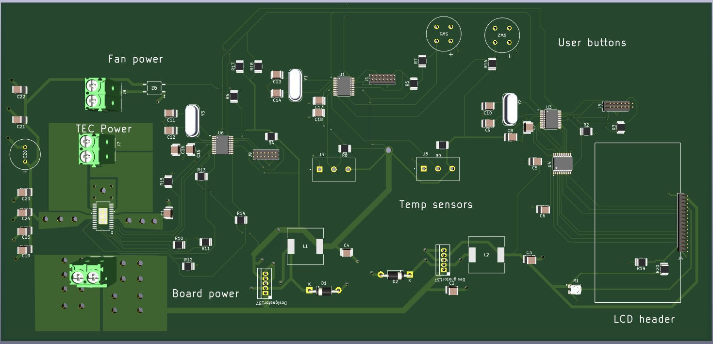
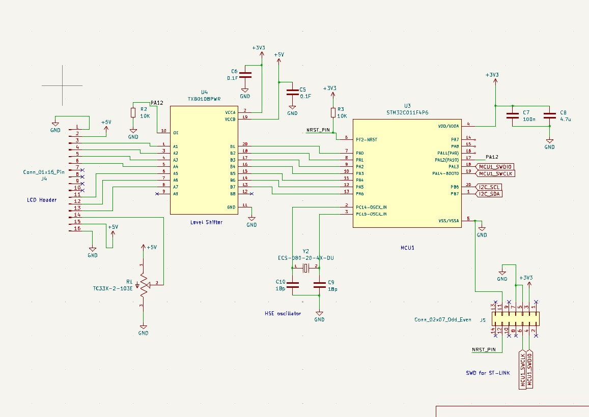
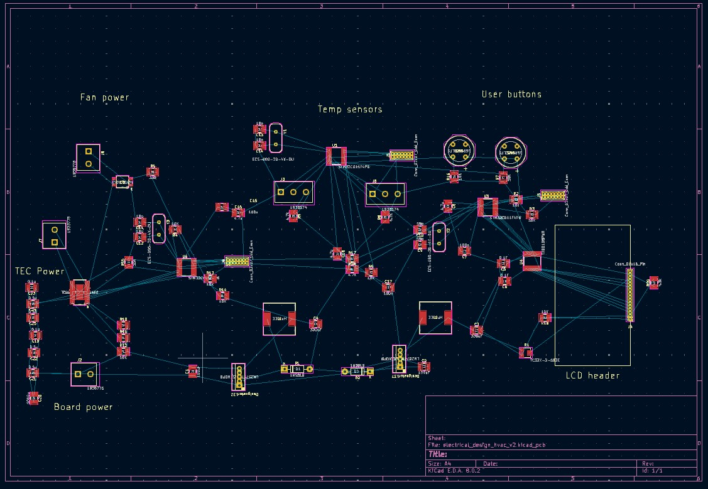

# mini_hvac_v2
Second version of the temperature control system for a small model room.

Photos:
As shown below, this version is made from three parts: Wooden structure, electronic boards, and thermal transfer area. 
The wooden structure is made up of a plywood base and a model room built from studs. There will be a drywall covering over the stud room to simulate a real temperature-controlled room.
The electronic boards are simply the PCB and the power supply for the project. There will be several wires running between the boards and the thermal transfer area.
The thermal transfer area is shown by the heatsinks and fans on the picture below. This area is composed of the TEC module, which creates a large temperature difference, and the heatsinks and fans that allow the TEC module to move thermal energy out of or into the room.

Current PCB 3D Model:

One schematic page i've been working on:

Current PCB Design:

